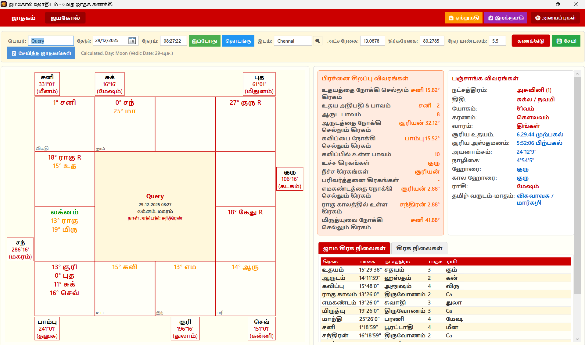
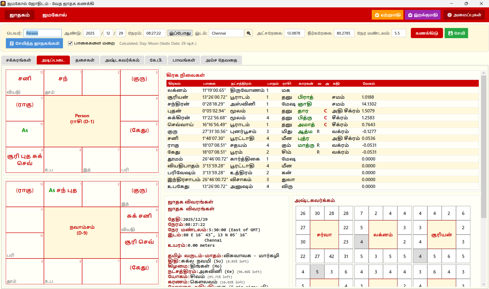
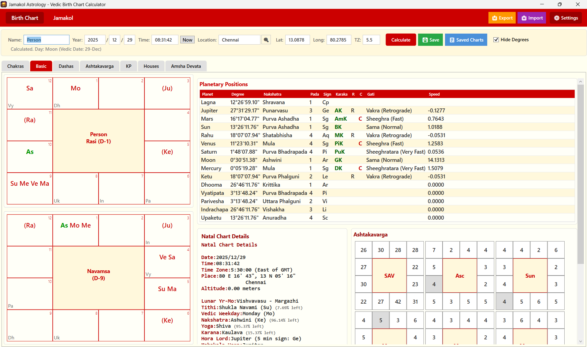

# Jamakol Astrology Software

A comprehensive desktop application for **Vedic Astrology**, specialized in **Jamakol Prasanam** (ஜாமக்கோள் பிரசன்னம்) and detailed **Birth Chart** analysis. Built with WPF and C# .NET, utilizing the Swiss Ephemeris for high-precision astronomical calculations.




> [!NOTE] 
> **Work in Progress**: This software is currently under active development. Features may change, and bugs may be present.

## ✨ Key Features

### 🕉️ Jamakol Prasanam
The core feature of this application is the robust **Jamakol Prasanam** module, designed for instant astrological queries.
* **Real-time Chart**: Interactive South Indian style chart with **(optional) Fixed Sign Boxes** support.
* **Special Points Calculation**:
  * **Aarudam (AR)**: Calculated based on the exact minute of the query (5-minute mapping).
  * **Udayam (UD)**: Calculated based on the Ascendant (Lagna) sign.
  * **Kavippu (KV)**: Derived from the interaction between Aarudam and Udayam.
  * **Jamakol Values**: Unique scoring system for Houses, Planets, Lagna, Surya, and Chandra.
* **Jama Grahas**: Accurate positions of the 8 invisible planets (Yama Shukra, Yama Guru, etc.) dynamically calculated based on time.
* **Live Clock**: Auto-updating timer for instant "right-now" queries.

### 🌌 Birth Chart Analysis


A full-featured horoscope generation engine powered by **Swiss Ephemeris**.
* **High Precision**: Planetary longitudes calculated to the second.
* **Combustion (Asta) Settings**:
  * **Mars**: 17°
  * **Mercury**: 14° (12° if Retrograde)
  * **Jupiter**: 11°
  * **Venus**: 10° (8° if Retrograde)
  * **Saturn**: 15°
* **Ayanamsa Support**: Comprehensive support for 30+ Ayanamsas used in Vedic and Western astrology:
  * **Standard**: Lahiri (Chitrapaksha), KP (Krishnamurti), Raman, Fagan-Bradley.
  * **Vedic/Siddhantic**: Suryasiddhanta (True/Mean), Aryabhata (True/Mean), SS Revati, SS Citra.
  * **Star-Based**: True Chitra (Spica), True Revati, True Pushya, True Mula (Chandra Hari), Dhruva.
  * **Babylonian**: Kugler (1, 2, 3), Huber, Eta Piscium, Aldebaran.
  * **Galactic**: Galactic Center (0 Sag, Gil Brand, Mula Bol), Skydram.
  * **Western/Historical**: Hipparchus, Sassanian, J2000, J1900, B1950.
  * **Others**: De Luce, Usha-Shashi, Djwhal Khul, Yukteshwar, JN Bhasin.
* **Divisional Charts (Vargas)**: Complete support for all major Vargas:
  * D1 (Rasi), D2 (Hora), D3 (Drekkana), D4 (Chaturthamsha), D7 (Saptamia), D9 (Navamsa)
  * D10 (Dasamsa), D12 (Dwadasamsa), D16 (Shodashamsa), D20, D24, D27, D30, D40, D45, D60.
* **10+ House Systems**:
  * Comprehensive support for major house systems including **Placidus** (KP), **Koch**, **Porphyry** (Sripathi), **Regiomontanus**, **Campanus**, **Equal**, **Whole Sign**, **Alcabitus**, **Topocentric**, and **Axial**.
  * Customizable Cusp calculation (Start of House or Middle of House).
* **Ashtakavarga**:
  * **Bhinna Ashtakavarga (BAV)** for all 7 planets.
  * **Samudaya Ashtakavarga (SAV)** total points.
* **Vimshottari Dasha**: Hierarchical view of Dasha, Bhukti, and Antara periods.
* **KP Astrology (Krishnamurti Paddhati)**:
  * KP Chart and Cusp details (Placidus House System).
  * Lord hierarchy: Sign Lord, Star Lord, Sub Lord, Sub-Sub Lord.
* **Amsha Devata**: Detailed analysis of Amsha Devata deities (e.g., Agni, Vayu, Indra for D60).
* **Jaimini Karakas**: Automatic calculation of 7 Karakas (Atmakaraka, Amatyakaraka, etc.).

### 🗓️ Panchanga (Almanac)
Real-time calculation of the five limbs of time:
1.  **Tithi**: Lunar day (e.g., Shukla Paksha Prathamai).
2.  **Vara**: Weekday.
3.  **Nakshatra**: Star constellation.
4.  **Yoga**: Nithya Yoga.
5.  **Karana**: Half-tithi.
* **Extras**: **Kala Hora**, **Nazhikai**, and **Tamil Month/Date** calculation.

### 🌍 Global Atlas
* **Massive Database**: Built-in offline database of **226,000+ cities** worldwide.
* **Instant Lookup**: Search by city name for accurate latitude, longitude, and timezone data without an internet connection.

### 🛠️ Tools & Utilities
* **Save & Load**: Store unlimited charts locally (JSON format).
* **Organization**: Group charts by **Categories** and **Tags** for easy retrieval.
* **Import/Export**: Backup your entire chart database to a single JSON file or share with others.
* **Settings & Customization**:
  * Visual: Adjustable font sizes for Tables, Charts, and Inputs.
  * Computation: **4 Advanced Sunrise Calculation Modes**:
    1.  **Tip (Upper Limb) + Apparent** (Standard for most almanacs).
    2.  **Tip (Upper Limb) + True** (Geometric).
    3.  **Center + Apparent** (Refraction corrected).
    4.  **Center + True** (Astronomical center).
  * Usage: Toggle "Hide Degrees" for cleaner presentations.

## 🕰️ Supported Date Ranges

The application comes bundled with extensive Swiss Ephemeris data files, allowing for deep historical and futuristic analysis.

*   **Range**: Approximately **13,000 BCE** to **16,800 CE**.
*   **Precision**: High-precision calculations are available throughout this entire period, making it suitable for research into ancient historical charts and long-term astrological cycles.

> [!NOTE] 
> **BC Date Convention**: This software follows the **Astronomical Year Numbering** used by Swiss Ephemeris.
> *   **Year 0** corresponds to **1 BCE**
> *   **Year -1** corresponds to **2 BCE**
> *   *Formula*: `Astronomical Year = 1 - Historical Year (BCE)`

## 🌍 Supported Languages

The application is fully localized in:
*   **English** (Default)
*   **Tamil** (தமிழ்)

## 🏗️ Technical Architecture

This project is built using **C# .NET 8.0 (WPF)** following the **MVVM** pattern.

### Project Structure
* **`MainWindow.xaml`**: The application shell, orchestrating navigation between tabs (Birth Chart vs. Jamakol).
* **`Controls/`**: Reusable UI components.
  * `JamakolChart.xaml`: The custom canvas-based drawing logic for the South Indian chart.
  * `BirthInputPanel.xaml`: Data entry form for birth details.
  * `*DetailsPanel.xaml`: Modular panels for displaying specific astrological data (KP, Ashtakavarga, etc.).
* **`Services/`**: The core business logic layer.
  * **`ChartOrchestratorService.cs`**: The main director that coordinates calls to all other calculators.
  * **`EphemerisService.cs`**: Integration wrapper for `SwissEphNet` (swedll32.dll/swedll64.dll).
  * **`JamakolCalculator.cs`**: Implements the unique arithmetic specific to Jamakol Prasanam.
  * **`PanchangaCalculator.cs`**: Logic for Tithi, Nakshatra, and Yoga calculations.
* **`Models/`**: Data structures.
  * `ChartData.cs`: The universal object holding all calculated planetary and house data.
  * `AppSettings.cs`: Manages user preferences and persistent storage.

### Data Storage
* Charts and user settings are stored in `%LOCALAPPDATA%\JamakolAstrology\`.
* Data format: **JSON**.

## 💻 Tech Stack
* **Language**: C# 12.0 / .NET 8.0
* **Framework**: WPF (Windows Presentation Foundation)
* **Libraries**:
  * `SwissEphNet`: .NET wrapper for the Swiss Ephemeris.
  * `System.Text.Json`: High-performance JSON serialization.

## 🚀 Installation & Build

1. **Clone the repository**:
   ```bash
   git clone https://github.com/nagarajan010/jamakol-desktop-app.git
   ```
2. **Prerequisites**:
   * Visual Studio 2022 (Community or higher).
   * .NET 8.0 Desktop Runtime.
3. **Ephemeris Files**:
   * The application requires standard Swiss Ephemeris files (`sea_*.se1`, `sefstars.txt`).
   * These should be placed in the `ephe/` directory in the build output or project root.
4. **Build**:
   * Open `JamakolAstrology.sln`.
   * select **Debug** or **Release** mode.
   * `Ctrl + Shift + B` to build.

## 📦 Creating an Installer

To create a distributable `.exe` setup file:

1.  **Prerequisites**:
    *   Install [Inno Setup 6](https://jrsoftware.org/isdl.php).
    *   Ensure `ISCC.exe` is available at `C:\Program Files (x86)\Inno Setup 6\ISCC.exe` (default location).

2.  **Run Build Script**:
    *   Double-click `build-installer.bat` in the project root.
    *   **OR** run from command line:
        ```bash
        .\build-installer.bat
        ```

3.  **Output**:
    *   The creation process will compile the app and generate the installer.
    *   Find the setup file in the `installer/` directory (e.g., `installer/JamakolAstrology_Setup.exe`).

## 📋 Requirements
* **OS**: Windows 10 or Windows 11 (64-bit required).
* **Note**: Windows 7 and 8 are **not supported** due to .NET 8.0 requirements.
* **Screen Resolution**: Minimum 1366x768 (1920x1080 recommended for best experience).

## 🤝 Feedback & Contribution

Found a bug or have a feature request? Please help us improve by reporting it:

*   **Bug Reports**: Open a [New Issue](https://github.com/nagarajan010/jamakol-desktop-app/issues) with a detailed description.
*   **Feature Requests**: We welcome ideas! Feel free to discuss them in the Issues section.

## 🙏 Acknowledgements

*   Special thanks to the [kunjara/jyotish](https://github.com/kunjara/jyotish/) repository. Their open-source code was incredibly helpful in verifying calculation logic and understanding complex astrological algorithms.
*   **Jagannath Hora (JHora)** and other established astrology software provided valuable design inspiration and served as a reference for calculation accuracy.

## 📜 License

This project is licensed under the **GNU Affero General Public License v3.0 (AGPL-3.0)**.

### ⚠️ Swiss Ephemeris
This software uses the **Swiss Ephemeris** for astronomical calculations.
*   **Copyright**: © Astrodienst AG, Zürich, Switzerland.
*   **License**: The Swiss Ephemeris is licensed under the **GNU Affero General Public License v3.0 (AGPL-3.0)**.

> [!IMPORTANT]
> Because this application links to the Swiss Ephemeris, **this entire project is also subject to the AGPL-3.0 license terms** (unless a commercial license is obtained from Astrodienst).

---

